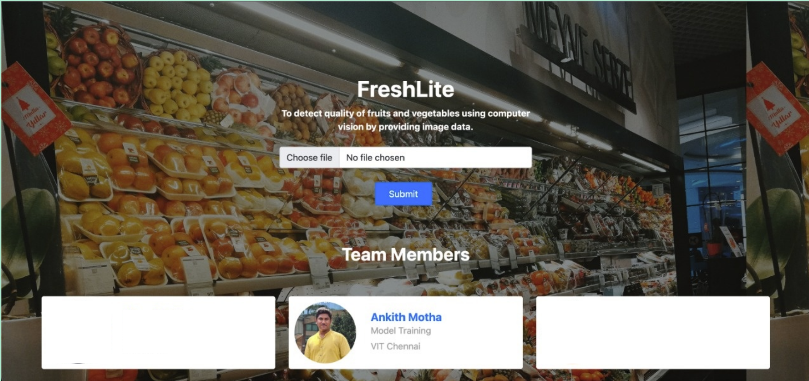

# NUS Internship Project: FreshLite

&nbsp;
[![Tensorflow](data:image/png;base64,iVBORw0KGgoAAAANSUhEUgAAAUkAAACZCAMAAACVHTgBAAABF1BMVEX////gXjCeoaD0tz/qii+bnp3gXCz87+rfVyTFx8a9v77fWSf++vjjdE/fWSbjck729vbrnoj43dXiZjvq6urso4veTxDplH3hYjHfVB7oh2fqlHjrj0ruoVemqai0t7bf4ODslFTvsJ3phiP///biZy/upWzzxrjgYzrphzLleUDrkTrslUrT1NT1zayrraz0sy/ywK/10MXuokv0uUr0uVXxr1fuq5j65+D43NLniGrNzs7lfVvia0L76s799uj3yXr53an40pL65L/88Nv40pH1wWPyuHnoh03ysEv3wUvuo2Dyu4/mfE3smm/54c7SzcHtnETd28fd6Oq0wbzxrTn1y6vs/f/nfzu3x8731bzdRwDxsX8dP9S0AAAKeklEQVR4nO2aa2PaRhZAJQwjgWReAsyADSrUkROb2Mh2eMdxk6Zxmt1N2t1tu93//zt27jykEWAb/CLp3vMhsYbRWDmZuXPnCsNAEARBEARBEARBEARBEARBEARBEARBEARBEARBEARBEARBEARBEARBEARBEETw+mLTT/DX4OLN1vnlph/iL8DFDycnW1sn799u+kG+dS7PmUfOm3ebfpZvmbeRRzYtTy4xXN6Rd2+2Epycv3U3/UzfIhc/npxszXHy/vWmH+ub4/vLswWPIlziEl8LPUBune+dftTD5febfrpvh9fvtUl49ir9nfniXFviZ5cYLleCBUjN49WXdPo7Ynq7uksMlytwcbmlL2zmkZk0Gd7eGYbLNXirbzTnp4fpyKRJXryKw+XZT5t+0q+b19oShgApESYZH64+qo+ebfpZb6JY2ezvv3ijzcePV1/SkUkiTRLviC3xj68O011u0rWW8zQ7UnEJ/AO/nX2SB7iOH7QAeXYee2QmDxw1K1m45IqFyQ4ly6CdJ3ngXCY1T8ZnHo8zmc2a3D+KwuD5aVpnr9yoRdPy4Hk6Nmmby9ioyUomk9qwSUJmp2fJAKlMGkYwpVLTV20yBSZTmzdJzA/nLAp+SS+aNKwBtcmCyVpeIFa/I69qT2gyk+QrMQmL92fd49FhZJK53DFJbPITNAXNHUHTg0921FX4JA/MTbZzCSpfjUnzxWHk8XD3b0eaScMYFSjhJrvpl8nt2domJik88SESTGYW8p2vz+Th7ozMkibZJCzYB8+7h5/m70WTOrZmsps+euERU5jsxiYNq0q6z4YL9y4x6Y6CflBe8nvKQT+cG2EY9PuhNdcPBpjvKHqH/QDaVzRZ9Hv+02bqnZmtTHZ//jufocLk4Sv9Fc7wH0vuXTAZjGs1SmktX1Uuqvl6nVruoM7b651I3LCUhyZa80rleIRwTHlHLxqgPKvXSdMIt8UAw5VMFrMtsRW1fXHdTrVSbfVpjl34qmem1UpF92WzuVw2a/SyUEKcfF6zkGg1HYcwk93Dl26V5zfcJKRGP94y1JxJq2nLXJ7YXl+0lWxCaqMGJbJ9KlUGnk1U3/pYanN3zLxspDM5QNkjJN/sEzFybSWTvZbKlDKpHD8A8W1KyWtpqacP9/XicX714X62hRnFP9Y1yR62QV+kDz8xI5HJL/wofrJ1c303adLisxtOO1yFyIlKNpw2Hd4OY9tT3j3kHlVf27PEcEK4+KM2cKVJdsTKy/+J2Sqre6JnnJljUNnTboKuqZa8LwsfFONxisLkL8xpbn2Thht8+IlPC2ly71yV0m5+450w6Y5BWr4+m3kOAT2hMsnUOMTzTGg26QD6Trlbj/U1mVObW3enMCEdh61m/hiilZuEK4cQm5ZWMNnLiNkIWSdXCYK0qcdFqxHa7OJYG0eYvGAj/bNyB5MRwiQvWCj+dYPKhMkBBZF99j9iBQUQNbOUSZPuhJY77IMUcsCahzXQG7A7rdGgQD1XDWDSRn9UDqswB0mtHJkkpBSEQWc7vN0kn3KZ1sSvVHrH/GdobrG/c6KraJwIca3ox4TJ3rvfPhv3N2mS/VNV0zhN/3s1ky5TQzyZnA9hzuX7ymS+JJpHM2YlH7AoyaTZAzmKWwr4PaDMqbpaz6YrTRIiBnZdGfKO2xIV4mKT4nOhupjlK7kiVjFf51we69uOb9P/W4TJd79Ner88hEn26L9DTfL8im1EL6/vrpvs2/rJe8iuHAiJPE5OVSiFE7tdZZ2ZSdpPDjaAW8bqqgwT1ClLk3ntICrO3eqcqHaOyGSFi4rktGW7HynzRRRt8YtJJFgiTRp/MNMPYtI0679f8RrbiibdHTYLaZzOjOHSEiaj2WdYbFU7DdcIIRJ4iVTShVlox4lkSUoHk8TTEsxEBWPRZC+ZWFZ4L7mM+QRms7N1LCpxfKWrRS+Qq9v4le05n1dRdg1Vvcqzz086K5qEH52Gag8HBeaFhkIIjQ/knrjBghlHvI6WiirJijL0KEiT29ovvcVke269qmv2t1jRzOJxT905lwM9HHc3CcuZb7auFYxnhCc5sNjBZC2eUVPC56K7w7d0e1aNCu08dGqL2JpC2HS5yXjRG9JkS6F2i8gk+NXX60TKmsiMsgKzsCjzoMpcDvRw3MMkm1I0MMqdJqE8CWIpi61Mxsu44Zikbqnck7l0VAWpw0w6gTY4hIv8UJhsau187/aTLx40k5lUcr3yADmRW3qFr34mtiUMgt6W8RhIk15sstv9z/XdNZM88jUKkPaJc8u0FMIH15g0rIY84+RJIYx+tV6Xgzvzo2tMXpsFFedN6pMV5ias8iIMAhe5Ryu0y8x8d1+Z7O7dIHLepDjHEIfWpp2RXLXXmTTc/ow68ri44y4xCQ323UzqcmDL4WqFNdh52OL3+U5TjHaeB0dm5rvp5/tgsnt0QzJpJEyWa9KKXWj2tU35WpOM/tgUa4CyxBGSIKKvbj4nr1vdq89JX6n1ecLjy248msJNrUcJk7HJdPp5fb/7ab7kNYceJ/mcrNWrc2Wym0wa7qhK+VGb5ZaQYtpaiulCHpW31jXJ42Rbs9OTcVIkmkURJo0ibOkVX+3nD49mkrm89asrukmerCzWFW80yXA7ULAgM2PEJrVdij8YsvyS1I21TYIvfZ7xEoUPP0GE9NkfPCefwIWMlo9BwuTerd31zBwceYtdbjMJ9TU2iGm5sGXN4nwSsiJIUNc1mcskYh+EQpnoZCE2tmTBgq/y1rKRHoa7m+RxjgYLXW43KQ6UZXEqipc3HBJhvHVN8rgYV3d4GnkcdYmS+aLK7W/9R96Ne5gs8wP2QmC9xuRopHXJszuHRgADzFR86KirdU2KSRgVNlLaVSb6woYhK0JzR8UH5B4mDShP5qUJN6DyrL3cpFWojVWeFEJANF3DhUMNqfMs1Nqh8oy0tklRnsxk+YL241qvIQ6OsOsYUbfHyoHuZ7Jch+PdrBSMgsE0T/JipS83yQ40DmlU+2HYr/Ji2pR9FtZ4UXhcHZS2+WGyDiOvbVLWH49zk2w7lbAlHLfjG1RF6BG4j0m2R/BSOaX8axvkz6hmvmByyF86ONBV9CV8sXds0Wzzdw3E468o1zdZaUV1t0SRQy51eVIXUeCRciBmksYmu+uaNPpO/OU2Qht8oS816XaIeh8m+srKxYDGrXZehNL1TTJjcblI/wIblxe9VcxlUsly+YNS5i8Bucmbz4kCa0ZtqmUuoyl1+BcAnejVYKlm239qJimbcVDBGBTYbJR9t6MdO5zWxAA2Lcm9Z2TaNk2aZCwxqZV9i9mM3F3Ua9r41pTKNXtLx3kw3L5nE2aym/60wlcr3E61WtWLjG44nh0ceLNmoOQFrEcp7tFnl+IFgxVWCwfewYHWl7fyAQqD6MsH1oDdoWdXfpaxcMQrQqsfXVYmPEPP+YmOFdanl7jj9n/j3XEHZn23+9+7fzXfveWIqbP0e8DrDHATj3OgXodh89myL1wgCIIgCIIgCIIgCIIgCIIgCIIgCIIgCIIgCIIgCIIgCIIgCIIgCIIgCIIgCIIgCIIgCIIgCIIg/3f8D01SEDDB9K9UAAAAAElFTkSuQmCC)](https://www.tensorflow.org/)[![Keras](data:image/png;base64,iVBORw0KGgoAAAANSUhEUgAAAX0AAACECAMAAABLTQsGAAAAxlBMVEX////QAAAvLy/MAADzwMDZRUX/+Pj40tL21NQhISEsLCwjIyOZmZn64eEVFRXa2tqkpKRBQUEbGxsnJye0tLTLy8uOjo729vbh4eF1dXXu7u7yxcWrq6vq6urR0dFJSUlkZGS/v7/ie3s0NDR8fHxbW1tra2uHh4d3d3cODg5OTk7ExMSDg4NCQkKlpaVVVVXtsLDQGhraWlrTNTXmkpLSJCTPEhIAAAD76OjXTk7TODjcaGjigoLsq6vfcnLttrbXSkronJyBteOvAAAMOUlEQVR4nO2dfYOauBbGGexOm0BREwV0ULH4MqNOp3e72+1ud2/v/f5f6qKSFyCQADppvXn+6mg44I/DyclJQi3LyMjIyMjIyMjIyMjI6Bq6f/PKutf9i38kve3dvap6b3X/4h9Jr03/7p3uX/wjydDXKUNfpwx9nTL0dcrQ1ylDX6cMfZ0y9HXK0NcpQ1+nDH2dMvR1ytDXKUNfpwx9nTL0dcrQ1ylDX6cMfZ0y9HVKTr93llIjWTNDPy8p/c8PZ/1V1+jL96zVw28yexL6gT85arOvbTXaTDIFF2Tx+pLR773PGr6radh7oPbuP3ejP3jCJz2FNY0ihDM9LTsT0KlL0OfgW+9/70bfBfZJXr+6TYTguZEN8bgzAZ26BH0e/r8k8C9APwK3Av8C9HnPfyeF350+5/nO/AIEdKoz/YbwO9PnPf9nh9+ZPr8qVgV+V/o3Bb8r/aae35V+5FD48OeH35F+zvO/qMDvRv+2PL8j/eae340+5/n2LcDvRD/n+ar1og70Oc+/hbBjdaKf83y1sNOJPgffrhmL/UxqT7/HcVT2/A70ec+/Efgd6L9VN3IJ+jfo+e3pt4r5HeiP0O15fnv6LT2/LX2uvHA7nt+WfsuY35o+83x8Q57fkj4fdh4aTk22oR95NoGf1NX9mfojfxWv15uVu5ypogjGbnpMPDn4I+FJwvFH199ufTeaS22GS/cwSS8gfty6y37lFFAb+q1jfkv6IwZfKexM3WcEnPP0i4PAumoG5vF5cdT09EfgJwhkx3hxsWkYxQlKjZ4EENi5NTcg9I/nJxeQNrc3kbh5C/pdPL8N/eipkecHB0DTo/NRKBmJGg48eJRzOtMAcwcBN9cw9BcewDmbEHibCv792HNybY9lEeDtBtNy2+b0O3l+C/ojDr6C5y8hsIuC3lrw0wfnhsdJgmDj8cAQ/7T0Nx6AJZPp1XjCZ8r1sKBxeg0IlF2nOf1Ont+cfkPP9z0RqfTYcmmC0F9a00X+jnmscRA/iWmm+mNQshlsUFVrG7ml5k3p91qnmu3oN/T8Q9WPh7h0dEYfRMGuABhzT8pCeDfPeiqtvNiUHzxmtXz9Telz8N+0WojVjH70B732oYLnbzn4p6DO/Vl6cojvu48FZHDBtRrx97NoExeyGdcrtOVa40n5epvR5wtrLVfBNaLPPB8+K3g+Rwo79vB5mHB9KV6L6dsJpscckxqAUcy1CgjANHuBScFmoXue2WzK2bFPjaFD+msg6CYa0efDzteWSxCb0Geeb6tMoIfU0zBejWepX07DiIV09FFMn7Jfu/v5fD9Y5bMZ3znSBHDtjsNpYAXTvkvvF0xyzu8Ti85i0J8FaeMgnEeToZPeAPwiuOIm9HnPtyzpqrXO9Jnnp2w2cvoTh7jkmosyxGKKKp8j5uhDEFfc3/AJYmfn8nFrGhP8gI/8wQ4KH4lgvBoCLxLYbkC/+FqpX65MP+LgCzOGgpYk7oBD7nMaj4Cf+5ynD3E5fyHyk0npxpC+2OFPRQKP4xebW8FyIsh5m9B/KBz6/qq9bjjKpy+CpKWgTeaQOC58ccieCbjIxQmOPnSE47FMAm7L7FjIx5N+dh6kXIpSpv++CN+y/rlixond4hAHv9SvmO1ndwvaxUHoNMlM5UZRPH1Q6BKkCjKTucA/zgw6yqUlZfoi/Xk9+jaJ4TbtSkH5geZFujxQjiF+ZszZ8p8y+s5j/UUJRCI/5EjPM4NIeX1jC/pf6b/ur0ifuvyQeG79rwqyUAztcqCgj0Uu9FD60FYrnPIiNxRzh4ZVoa9Szem/5Yr7369W56Hwk5CWOPFO1HNlIo4nGtTQOAF5zJR+/pFQEznY4WL8dEhynpXitoLG9B96d3+xN5p+u1aNk8Lvs6c8/VXVB0aZfyNR/7kmgZ9PECl9aX8uOp2APu33bbCo3/1B1JT+w5f0s//SP+9ly/W70T+XF2Y09ojGi5m2WSgQVBLTkUCGBfBJ90CUt6hqJKK/pBefDh9GNQ8qUUP659oOl/k3LnM2oU+qmjT2FAdMnNbE77Z+WS+iYRANHocqmwUF01l/vl+OomgwIG6eo29tHHbtaOhKu5Nm9N9kn35msefv68wsnj2fsKajWKdqyBvQWqQjEP1ORF+QJJUVjvzHl2PZxgEnkXudpx8mXLUUAriRPACN6NNOtvcb+1C2Uas1fcwcfcrynoph0dSuqQRT5Uah1Pele7/67gsEDs7VN4X0rbnNF6shBsNDXafShD6X4XAD3+usaUjhP3NRhg58q7LDsHIORE5fkp7vYwwE3IX0rf5zPm2ADo6r724D+rn08ncWe5qV21Tps7Bz0iOJPaVCcfara6Y1OtGfbUDdjS3St6aH4tQiBruqDEid/qdcy97fzEajIa8ifVjI7WkubSNhmL4W/T0bdKvRT6PPpsx/I35i1es8hYZc7GlUbmu7jpMtKwGiUjCjD2vkNaW/zE0TQ4wdgBDyPE/c62aalybiMRSGn/araL+w2NOk3NZ6DfOKxqSdYCRJ6SfPw2rF/AOlQL/PwcfIS9Yr/+NouR/Pw5Uw46SauUn+AYCgY32/+M0HZuXXV1hBHrDYIyi3haSKLO4WRFKgn7A5RGeTW+FGBncV9K1jZ517ACASBP8uuyfeUCsNphnb756gsye2V+ZFMs5CDb9OcvoDmmkhv2BWTj+9poHNPTtwWM79O+0cYmbUy20ddg4daFFyWEJMR1tYYYB/lpw+edpguYkK/VSjhPG/wHqe3HffmJ1/v8K+reCZ1nvK5TZSihM94GJJ6ffJ1CYoD/Ee6+M+0wjTKfiyz3Tbs8hiz73ilsVOexb3NPaU301CCu5AOv9LJKVPyqaiMlysSt+axnSyv5Ssddyve69s6BL02ZINWAowZDQMRRmRUFL61L/LN5TMGCjQZwXActrTkf6vzJJiua0TfRZ7SuU2WmpAqptJpfSJfwvq2n1a9lOgTyZ+yrM4Xd8U8Ilauq99e9Vl6FtjOvIsrY8hHqay8uckdfrlrsRvQp/kyrjUW3V+SwaLPWrlto5vyaCxx0aFUj+J0rZ4ZXdZHXx/RqtuSvSzJ/bivn93x8UepXJbR/psvXFxaR6tBMlX/pzVIe7TuU4l+rMrxf1jg3+YMZVyW9f388zpJhKvAMVlVWhh6B8XAoiU/kda8St8sWUlvRz9cCAsppETlddkXODdVGyFyftXoM/NADzl27AyKARuMfHpD16QJ15JWEl/Tgp7+ZVE0wm3yo6nP7M9vJqXUq49KYKUp0Uv8F42LvYolNs602exBw7z37BShI2G7jw4cwim82j74gBY7I/lY11uIRcFFw4SvubM00/TLojRzt9P2R0I+gdS7RGs2boAfT72fLs+fS72FFe3cREBApSsJ4+Pk3iRAHSe2G1M/0A5g2QVLffLyI9xvnZcoH88s4Ps9cEdpc1Hg8MOUBuCRfAXeSMkiz1fX+GdhFzsKZTbgtzGHQhPWzbZpGBj+iFbRQ3xsbAPHPrcCUZbdMgBseOgoxxu9yIQLJ24yNtQ/2T2pOW2C9C3Xip2L1hBXDfF1Zh+bidQ3tRLDKvpC48QLcS7zLto2fIq64PE4CXo91m6XRjABCtUNf/dhr5VsQXRGc6yxWyq9MFClA5dhD4/9/5VsrrtEvS55ceoOBIaVE7EQq85/SAW4UfrmTVHZfqoCj9E4r3VUvokptdnk/9hFiWr2xTpP9WPYtYs/hYf6HCFi3vF7VNfuBjkCZBTgdo1DS4oWIPOKZ+dnW9yrm45evGw4NQYLSpWIUnpf88afqptyMUeyYhXQn8JTt2Vt6ifJAkxOssTzCT2t88I0N427Xwd5CwO42IiPvfOFqpXJ56tTWxEjB1NJauzYyTHw73n3HUG+8dhmmHlzw3XUVXZVV4Y/nCWpFXvA5HkDW2y9++PRyfJtn9kzUaRcHQZzAeTXYIdkCYpySLeRsLXhMzPJqSrLWfRKjWW2oLD9XZJcO/F1xnMo8N6kZ3bXsR+3U+53f97IghmYapZcIlX9J+NTVVNkXPLDrhd+j+DDH2dMvR1ytDXKUNfpwx9nTL0dcrQ1ylDX6cMfZ0y9HXK0NcpQ1+nDH2dMvR1ytDXKUNfpwx9nTL0dcrQ1ylDX6feff7lVfW57v2e/3+6f2Xp/r1GRkZGRkZGRkZGRkZGRkZGN6n/AQ/6IQsXxOiUAAAAAElFTkSuQmCC)](https://keras.io/)

[](https://www.numpy.org/)[](https://opencv.org/)
[](http://flask.pocoo.org/)[](https://www.python.org/)
[](https://azure.microsoft.com/)[](https://www.docker.com/)
&nbsp;

## Introduction:

---

##### FreshLite is a Deep Learning Solution for Fruit and Vegetable health detection

Built on Tensorflow - Keras using Python, this project adopts Ensemble Learning of Two Custom Models and One Pre-trained Model.
The Web App Interface is Created using Flask, Containerized using Docker and Hosted on Azure Web Services.
&nbsp;

##### Click on the image below to Try It Out !!

[](https://gaip-group-5.azurewebsites.net/)
&nbsp;

## Table Of Contents

- #### [Introduction](#introduction)
- #### [Technologies](#technologies-1)
- #### [Datasets](#datasets-1)
- #### [Data Preprocessing](#data-preprocessing-1)
- #### [Neural Network Architecture](#neural-network-architecture-1)
- #### [Setup](#setup-1)
- #### [Docker Deployment](#docker-deployment-1)
- #### [Additional Resources](#additional-resources-1)
- #### [Downloads](#downloads-1)

## Technologies

FreshLite utilizes several libraries and platforms (mostly Open Source) to operate seemlessly:

* **[Python]** :- Python is a high-level, interpreted, general-purpose programming language. It was designed for readability and is a cross-platform, interpreted, object-oriented programming language that is perfectly suited for Rapid Application Development, scripting, and connecting existing components together.
* **[Tensorflow]** :- TensorFlow is an end-to-end platform that makes it easy for you to build and deploy ML models. TensorFlow offers multiple levels of abstraction so you can choose the right one for your needs.
* **[Keras]** :- Keras is an open-source software library that provides a Python interface for artificial neural networks. Keras acts as an interface for the TensorFlow library.
* **[Flask]** :- Flask is a small and lightweight Python web framework that provides useful tools and features that make creating web applications in Python easier. It gives developers flexibility and is a more accessible framework for new developers since you can build a web application quickly using only a single Python file.
* **[OpenCV]** :- OpenCV is a great tool for image processing and performing computer vision tasks. It is an open-source library that can be used to perform tasks like face detection, objection tracking, landmark detection, and much more.
* **[Numpy]** :- NumPy is a library for the Python programming language which provides additional support for processing large, multi-dimensional arrays and matrices.
* **[Azure]** :- Azure is Microsoft's public cloud computing platform, with solutions including Infrastructure as a Service (IaaS), Platform as a Service (PaaS), and Software as a Service (SaaS) that can be used for services such as analytics, virtual computing, storage, networking, and much more.
* **[Docker]** :- Docker is a set of platform as a service products that use OS-level virtualization to deliver software in packages called containers. Docker enables you to separate your applications from your infrastructure so you can deliver software quickly.

## Datasets

| Source                | Links                                             |
| --------------------- | ------------------------------------------------- |
| Bing Image Search API | [Web Scrapper Program]                            |
| Kaggle Datasets       | [Fresh and Stale Images of Fruits and Vegetables] |
|                       | [Fruits fresh and rotten for classification]      |
| Custom Images         | Images taken using Camera                         |

## Data Preprocessing

> ##### Step 1: Split the dataset into Train and Test datasets
>
> Program: [Preprocess_1]

> ##### Step 2: Merge the multiple labels into Fresh and Rotten
>
> Program: [Preprocess_2]

Note: Remember to enter the path of dataset folders in place of double quotations (" ").

## Neural Network Architecture

&nbsp;

#### 1. [Custom Models] :


##### Layers:

- **Convolution Layer**: Convolution is an orderly procedure where two sources of information are intertwined; it’s an operation that changes a function into something else. Convolutions are used to perform operations such as enhancing edges and embossing, to _extract features from the image_.
- **Conv2D**: A filter or a kernel in a conv2D layer “slides” over the 2D input data,also called striding, performing an elementwise multiplication. As a result, it will be summing up the results into a single output pixel. The kernel will perform the same operation for every location it slides over, transforming a 2D matrix of features into a different 2D matrix of features.
- **MaxPooling2D**: This layer downsamples the input along its spatial dimensions (height and width) by taking the maximum value over an input window for each channel of the input. The window is shifted by strides along each dimension. It essentially compresses the image. This method is helpful to extract features with high importance or which are high-lighted in the image.
- **Flatten**: Flattening is converting the data into a 1-dimensional array for inputting it to the next layer. We flatten the output of the convolutional layers to create a single long feature vector and it is connected to the final classification model, which is called a fully-connected layer (Dense Layers).
- **Dense Layer/ Fully Connected Layer**: Dense Layer is simple layer of neurons in which each neuron receives input from all the neurons of previous layer, thus called as dense. Dense Layer is used to classify image based on output from convolutional layers.
- **[Dropout]**: Large neural nets trained on relatively small datasets can overfit the training data.
  Ensembles of neural networks with different model configurations are known to reduce overfitting, but require the additional computational expense of training and maintaining multiple models. A single model can be used to simulate having a large number of different network architectures by randomly dropping out nodes during training. This is called dropout and offers a very computationally cheap and remarkably effective regularization method to reduce overfitting and improve generalization error in deep neural networks of all kinds. During training, some number of layer outputs are randomly ignored or “dropped out”.

**_Check It Out_:**

- [Introduction To Convolution Neural Network]
- [Droput For Regularizing Deep Neural Networks]

&nbsp;

#### 2. Pretrained Model : MobileNet V2


[MobileNet-V2] is a convolutional neural network that is 53 layers deep. It is a light-weight model, that uses Depthwise Separable Convolution Layers to reduce the complexity cost, which is suitable to be used on mobile devices or devices with low computation power.
You can load a pretrained version of the network trained on more than a million images from the ImageNet database. However for our use, we have trained the model on our custom dataset with 2 output labels instead of 1000.

## Setup

##### This project was built on Windows 11

FreshLite requires [Python] v3.8+ to run.

##### Click below to visit Python 3.9.13 Download Page

[](https://www.python.org/downloads/release/python-3913/)

**NOTE:** Ensure you have **pip** installed, else follow the given [Pip Installation]
Install the following dependencies on your local machine and run [app.py].

###### Install [Flask] using pip

```sh
$ pip install Flask
```

###### Install [OpenCV] using pip

```sh
$ pip install opencv-python
```

###### Install [Numpy] using pip

```sh
$ pip install numpy
```

###### Install [Tensorflow] using pip

> Follow the instructions in the link for [Installation Of Tensorflow and GPU Setup](https://www.tensorflow.org/install/pip)

## Docker Deployment

FreshLite can be easily deployed using Docker.

> File : [Dockerfile]

By default, the Docker will expose port 8080, so change this within the
Dockerfile if necessary. When ready, simply use the Dockerfile to
build the image.

Assuming that all files are stored in folder: **NUS_G5_Internship**

```sh
cd NUS_G5_Internship
docker build NUS_G5_Internship --tag {name of image}
```

This will create the docker image.
Be sure to swap out `{name of image}` with the name you want to prvide.

Once done, run the Docker image and map the port to whatever you wish on
your host. In this example, we simply map port 8000 of the host to
port 8080 of the Docker (or whatever port was exposed in the Dockerfile):

```sh
docker run -p 8000:8080 {name of image}
```

Verify the deployment by navigating to your server address in
your preferred browser.

```sh
127.0.0.1:8000
```

## Additional Resources

> Refer the following resource for Deployment of Docker Image With Azure Web Services:
> https://docs.microsoft.com/en-us/learn/modules/deploy-run-container-app-service/

## Downloads

###### To Download this Repo using GIT BASH:

```sh
$ git clone https://github.com/Alpha-github/NUS_G5_Internship.git
```

###### To Download this Repo using GIT CLI:

```sh
gh repo clone Alpha-github/NUS_G5_Internship
```

## License

Apache License 2.0

   [Tensorflow]: [https://www.tensorflow.org/](https://www.tensorflow.org/)
   [Azure]: [https://azure.microsoft.com/](https://azure.microsoft.com/)
   [OpenCV]: [https://opencv.org/](https://opencv.org/)
   [Keras]: [https://keras.io/](https://keras.io/)
   [Python]: [https://www.python.org/](https://www.python.org/)
   [Flask]: [http://flask.pocoo.org/](http://flask.pocoo.org/)
   [Docker]: [https://www.docker.com/](https://www.docker.com/)
   [Numpy]: [https://www.numpy.org/](https://www.numpy.org/)
   [MobileNet-V2]: [https://towardsdatascience.com/review-mobilenetv2-light-weight-model-image-classification-8febb490e61c](https://towardsdatascience.com/review-mobilenetv2-light-weight-model-image-classification-8febb490e61c)
   [Web Scrapper Program]:<crawler.py>
   [Preprocess_1]: <preprocess.py>
   [Preprocess_2]: <preprocess2.py>
   [Custom Models]: <mod3.ipynb>
   [app.py]: <app.py>
   [Dockerfile]:`<Dockerfile>`
   [Introduction To Convolution Neural Network]: [https://towardsdatascience.com/introduction-to-convolutional-neural-network-cnn-de73f69c5b83#:~:text=Dense%20Layer%20is%20simple%20layer,multiple%20number%20of%20such%20neurons.](https://towardsdatascience.com/introduction-to-convolutional-neural-network-cnn-de73f69c5b83#:~:text=Dense%20Layer%20is%20simple%20layer,multiple%20number%20of%20such%20neurons.)
   [Dropout]: [https://machinelearningmastery.com/dropout-for-regularizing-deep-neural-networks/](https://machinelearningmastery.com/dropout-for-regularizing-deep-neural-networks/)
   [Droput For Regularizing Deep Neural Networks]: [https://machinelearningmastery.com/dropout-for-regularizing-deep-neural-networks/](https://machinelearningmastery.com/dropout-for-regularizing-deep-neural-networks/)
   [Pip Installation]:[https://www.geeksforgeeks.org/how-to-install-pip-on-windows/#:~:text=Step%201%3A%20Download%20the%20get,where%20the%20above%20file%20exists.&amp;text=Step%204%3A%20Now%20wait%20through%20the%20installation%20process.](https://www.geeksforgeeks.org/how-to-install-pip-on-windows/#:~:text=Step%201%3A%20Download%20the%20get,where%20the%20above%20file%20exists.&text=Step%204%3A%20Now%20wait%20through%20the%20installation%20process.)
   [Fresh and Stale Images of Fruits and Vegetables]: [https://www.kaggle.com/datasets/raghavrpotdar/fresh-and-stale-images-of-fruits-and-vegetables](https://www.kaggle.com/datasets/raghavrpotdar/fresh-and-stale-images-of-fruits-and-vegetables)
   [Fruits fresh and rotten for classification]: [https://www.kaggle.com/datasets/sriramr/fruits-fresh-and-rotten-for-classification](https://www.kaggle.com/datasets/sriramr/fruits-fresh-and-rotten-for-classification)
   [Click to go to Python 3.9.13 Download Page]: [https://www.python.org/downloads/release/python-3913/](https://www.python.org/downloads/release/python-3913/)
